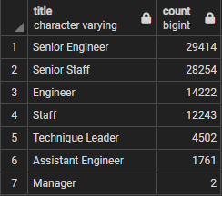
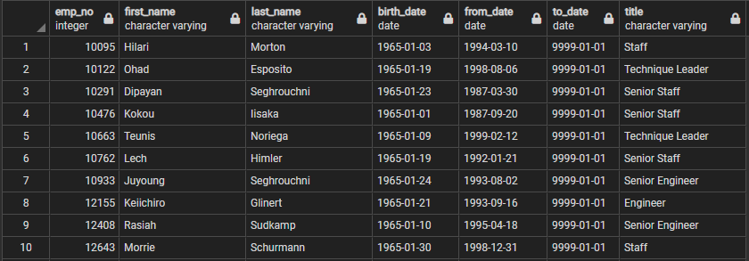

# Pewlett-Hackard-Analysis
# Analysis of Pewlett-Hackard Employee Retirement
> SQL database managed in pgAdmin. 

## Overview of Pewlett-Hackard Analysis
> Database consisting of 6 original CSVs of data, developed and analyzed through multiple queries to assist management in preparation of upcoming wave of retirements.

### Results
> Number of Retiring Employees by Title

    - The sum of all retiring employees is 90,398.  

    - More than half of the impending vacancies, 57,668 to be exact, are for 'Senior' positions. 

    - 45,397 (50%) of the positions are for engineers. 

    - Only 2 management positions will need to be filled. 

> Employees Eligible for Mentorship Program

    - There are 1,549 employees eligible for a mentorship program.  

    - The titles listed in the table are not necessarily the employees most recent title.  

    - Using 4 years worth of birth dates for retiring employees and only 1 year of dates for those eligible for mentorship creates a large discrepancy in the number of candidates. 

    - The data selected to curate this list does not indicate a candidates qualification to be a mentor. 

## Summary
> Organization and management of the data provided has allowed for better insight into the 'silver tsunami' Pewlett-Hackard is facing. While it answers some questions is does raise additional questions as well. 

        - 90,398 vacancies across 7 different job titles will need to be filled as the "silver tsunami" progresses. 

        - There are 1,549 employees considered 'retirement ready' who could be considered for mentorship roles. Willingness and qualification to hold such a role will undoubtedly impact this number. Given the high number of imminent retirements, this does not appear to be enough to meet the current mentorship needs of the company.  

        - An additional table showing the total number of current employees by title who are not of retirement age would be helpful to determine the percentage of each unique job that will be retiring. For instance if 90% of the company's engineers are retiring that would be a far more pressing concern than if 4% of them were. 

        - Another beneficial query would be the salary totals per department that will be freed up in the budget for hiring new candidates. 